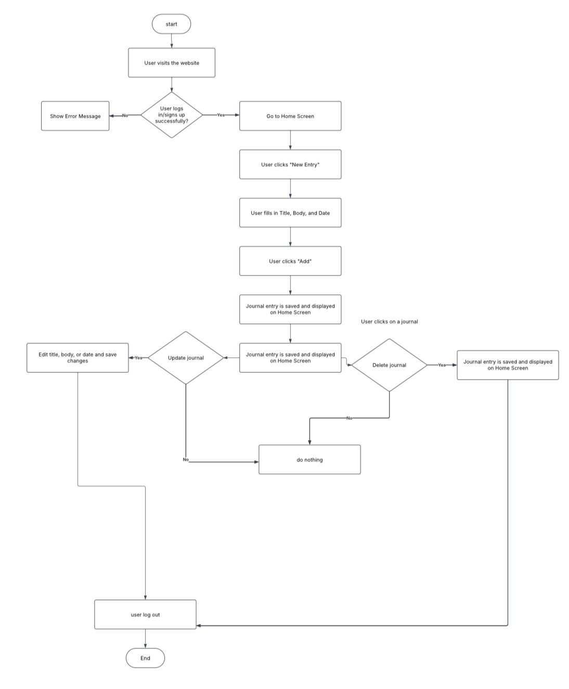
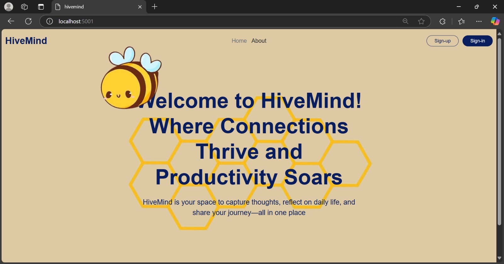
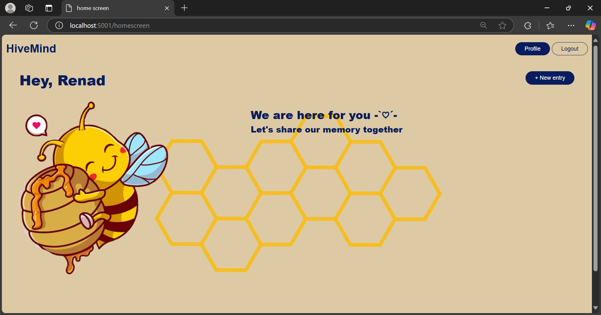
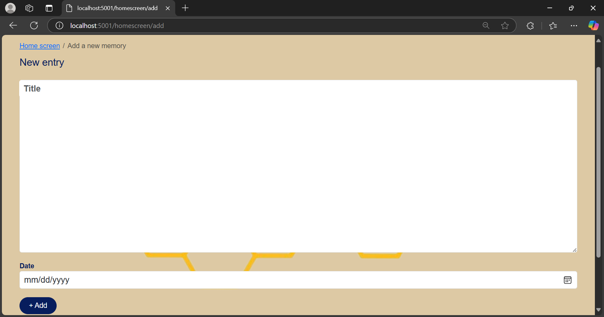
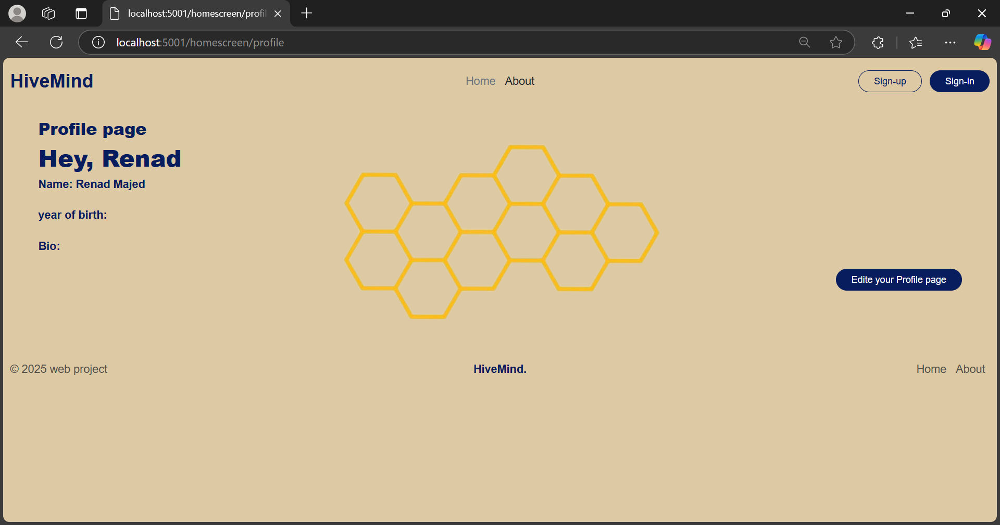

## Overview:
### Our website HiveMide is to create a place where people share there journals with others in a simple way , its allow people to post and update about there days giving the others the opportunity to explore different moment and experiences.

## Our goal:
### HiveMind help us create a space where people can freely share and watch different moment.

## Technologies Used:
### visual studio code
### 1-Frontend:
### •JavaScript
### •CSS
### •EJS 
### 2-Backend:
### •Node.js
### •Express.js
### 3-Database:
### •MongoDB

## SetUp
### Installation:
### first: install "nodeJs"
### second: after creating a project install these dependeses npm i connect-mongo dotenv ejs express express-ejs-layouts express-session method-override mongoose passport passport-google-oauth20 nodemon --save-dev
### last thing for starting the project : npm start

## Flow chart:

## Future work:
### •	We will add different categories like short stories.
### • We will make the pepole post there journals to others.
### •	We will make people add comment in the other people posts.

## some ScreenShots:
### Welcom page:

### Home page:

### Adding new journal page:

### Profile page:

## Resources:
### 1-images used:
### [image1](https://pin.it/lGuV7CJTf)
### [image2](https://pin.it/49XnKlBD3)
### [image3](https://pin.it/3mUx3LmN3)
### 2-video watched:
### [link](https://youtu.be/BDo1lgaZuII?si=PSYfi6kItVxwh2ls)

## Team member:
### Wateen Alrumayh
### Mha Alkithery 
### Renad Alrubaish

